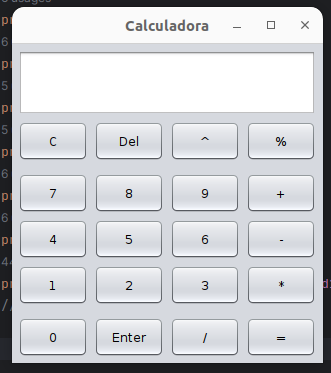

# Calculadora RPN (Reversed Polish Notation)

Nesse projeto pude aplicar os conhecimentos adquiridos sobre os recursos básicos da linguagem Java, como:
- Tipos de dados;
- Operadores aritméticos, relacionais e lógicos;
- Estruturas de controle (seleção e repetição);
- Tratamento de excessões;
- Criar interface gráfica usando JFrame

Além disso, também pude aplicar os conceitos de POO, como:
- Classes;
- Objetos (atributos e métodos);
- Encapsulamento;
- Hernaça e polimorfismo.